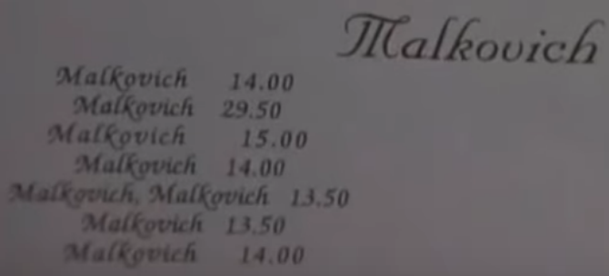

# Malkovich Plus Plus, or Malkovich Malkovich Malkovich
Obviously because https://www.youtube.com/watch?v=HPeattKV74A

## But it's so verbose!
Malkovich, Malkovich? Malkovich, Malkovich, Malkovich.

### Also, why are there numbers?
For all what we know about John Malkovich Arithmetic, numbers are still numbers:



## syntax
Malkovich Malkovich Malkovich is a simple, functional language.

### defining functions
1. functions are defined using the `malkovich!` prefix ([see examples](#-examples))
1. functions always return last statement
1. multi line functions need to end with `malkovich.`

### variables
1. variables are functions.
  - `malkovich! malkovich 'Malkovich'` assigns the string 'Malkovich' to the variable `malkovich`

### print
1. `malkovich:` prefix prints to stdout

### equality
1. as an infix operator `malkovich?` works as `==`:
  - `'Malkovich' malkovich! 'Malkovich'` returns `Malkovich.` ([what is true in Malkovich Logic?](#-logic))
1. as an infix operator `?malkovich` works as `<`
1. as an infix operator `malkovich?` works as `>`

### loops
1. there is only a **while** loop
1. loop evaluates indefinitely until it's broken by `malkovich! malkovich! malkovich!`
1. starts with `malkovich malkovich...`
1. loop block closes with `malkovich.`


### arithmetic operations
The usual stuff: `+`, `-`, `*`, `/`, `^`

| symbol | meaning            |
| ------ | ------------------ |
| `+`    | add                |
| `-`    | subtract           |
| `*`    | multiply           |
| `/`    | divide             |
| `//`   | integer division   |
| `%`    | division remainder |


### logic
Truth is simple in Malkovich Logic - it's either Being John Malkovich, or Not Being John Malkovich.

#### Malkovich Logic
Here is a mapping table between Malkovich and Boolean Logic

| Malkovich Logic | Boolean Logic |
| --------------- | ------------- |
| `Malkovich.`    | `True`        |
| `Malkovich!`    | `False`       |

#### logical operators
The usual stuff, but only in symbols

| symbol | meaning    |
| ------ | ---------- |
| `&`    | `and`      |
| `\|\|` | `or`       |
| `~`    | `not`      |

Why no keywords? Malkovich Malkovich!

### conditional statements
```
if condition1
  do something
else if condition2
  do something_else
else if condition3
  do something_different
else
  do something_completely_different
```
becomes
```
malkovich? condition1: something
malkovich malkovich? condition2: something_else
malkovich malkovich? condition3: something_different
malkovich malkovich! something_completely_different
```
or with multi line statements
```
malkovich? condition1:
  something
malkovich.
malkovich malkovich? condition2:
  something_else
malkovich.
malkovich malkovich? condition3:
  something_different
malkovich.
malkovich malkovich!
  something_completely_different
malkovich.
```

## Examples

### ~`hello world`~ `Malkovich`
**malkovich.malpp**
```
malkovich! malkovich 'Malkovich, Malkovich'
malkovich: malkovich
```
Then run it
```
$ malkovich malkovich malkovich malkovich.malpp
Malkovich Malkovich
```

### function with one argument
**malkovich_malkovich.malpp**
```
`malkovich! malkovich, malkovich, malkovich**2`
malkovich: malkovich(3)
```

```
$ malkovich malkovich malkovich malkovich_malkovich.malpp
9
```
### function with two arguments
**malkovich_malkovichmalkovich.malpp**
```
`malkovich! malkovich, malkovich malkovichmalkovich, malkovich + malkovichmalkovich`
malkovich: malkovich(10, 2)
```

```
$ malkovich malkovich malkovich malkovich_malkovichmalkovich.malpp
12
```

### conditional statements

Let's find the first natural number divisible by 7
**malkovich_malkovich_malkovich.malpp**
```
malkovich! malkovich 0
malkovich malkovich...
  malkovich! malkovich malkovich + 1
  malkovich? malkovich % 7 malkovich! 0:
    malkovich: 'Malkovich Malkovich: ' + malkovich
    malkovich! malkovich! malkovich!
  malkovich malkovich.
malkovich malkovich.
```

```
$ malkovich malkovich malkovich malkovich_malkovich_malkovich.malpp
Malkovich Malkovich: 7
```

###  Fibonacci sequence
Let's find first 10 Fibonacci numbers
**malkovichmalkovich_malkovichmalkovich.malpp**
```
malkovich! malkovichmalkovich, malkovich,
  malkovich? malkovich malkovich? 0: 0
  malkovich malkovich? malkovich ? 1: 1
  malkovich malkovich! malkovichmalkovich(malkovich-1) + malkovichmalkovich(malkovich-2)
malkovich.

malkovich! malkovich 0
malkovich malkovich...
  malkovich! malkovich malkovich + 1
  malkovich: malkovichmalkovich(malkovich)
  malkovich? malkovich malkovich? 10:
    malkovich! malkovich! malkovich!
malkovich malkovich.
```

```
$ malkovich malkovich malkovich malkovich_malkovich_malkovich_malkovich.malpp
0
1
1
2
3
5
8
13
21
34
```
